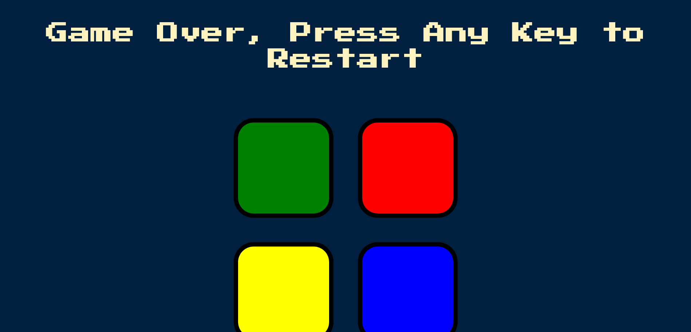

# Simon Game

A web based memory game built using HTML,CSS and JS.  

## Introduction - the project's aim

Simon Game is a memory game invented by Ralph H. Baer and Howard J. Morrison.
Three different boxes are present (check the screenshots) and pressing each of these boxes will produce a different sound. Initially a sound will be played and then user must must listen the sound path of the game and click the buttons in correct order. If the user click wrong button the game will end.
## Technologies

1.HTML5

2.CSS3

3.Javascript

## Screenshots

